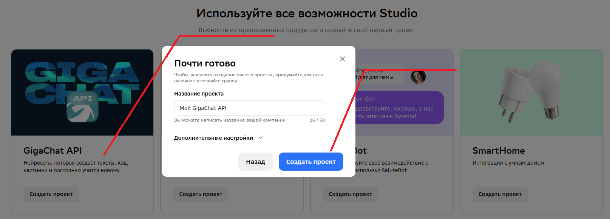
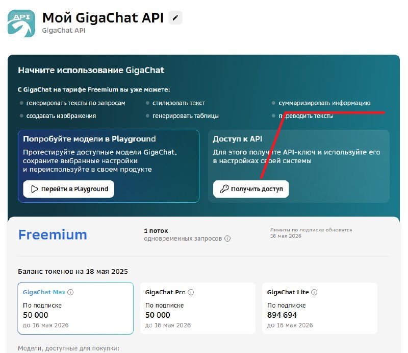
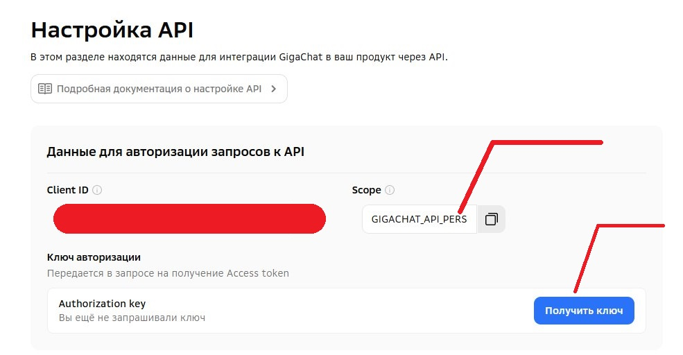

# GigaChat API

**Асинхронный класс для обращения к API GigaChat.**

> pip install git+https://github.com/iMWC-IXIVI/gigachat_api

---

## Быстрый старт

* Необходимо зарегистрироваться на [сайте](https://giga.chat/)
* Перейти в [режим разработчика](https://developers.sber.ru/studio/workspaces/) и авторизоваться там
* Создать GigaChat API проект 
* Перейти на настройки API проекта 
* Получаем Authorization key 
* Сохраняем Authorization key и Scope в переменные окружения.

```python
import asyncio

from gigachat_api import GigaChat


AUTH = '<key>'
SCOPE = '<scope>'

async def main():
    giga = await GigaChat.create(AUTH, SCOPE)
    models = await giga.get_models()  # Список всех поддерживающих моделей
    giga_answer = await giga.send_message('GigaChat', 'Помоги создать репозиторий', 'Ты профессионал платформы GitVerse')  # Ответ от нейросети
    print(models, giga_answer, sep='\n')

    
loop = asyncio.get_event_loop()
asyncio.set_event_loop(loop)
loop.run_until_complete(main())
```

---

## Заключение

Класс `GigaChat` предоставляет простой и эффективный способ интеграции с GigaChat API через асинхронный Python-код. Он поддерживает автоматическое обновление access-токена, удобную отправку сообщений и получение списка моделей.

Ты можешь использовать его как основу для:

- чат-ботов (в Telegram, Discord и т.д.),
- веб-интерфейсов (на FastAPI),
- автоматизированных агентов и маскотов.

---
